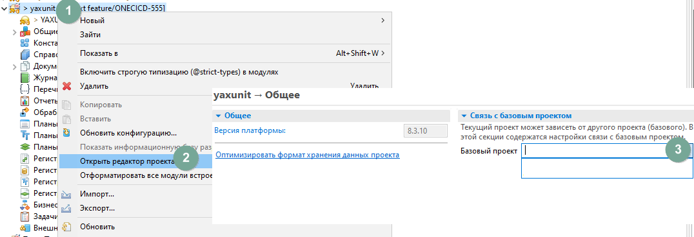

# Установка

## Установка в EDT

### Первичная установка тестового движка в рабочее пространство (workspace)

1. Качаем архив [последнего релиза](https://github.com/bia-technologies/yaxunit/releases/latest)
2. Распаковываем содержимое в каталог с исходниками (не в воркспейс)
3. Импортируем проект

   
4. Привязываем импортированный проект расширения к конфигурации

   

5. Обновляем конфигурацию
6. В конфигураторе снимаем с расширения **безопасный режим** и **защиту от опасных действий**
7. Готово, можно приступить к написанию тестов.

### Обновление тестового движка

1. Качаем архив [последнего релиза](https://github.com/bia-technologies/yaxunit/releases/latest)
2. Если вы дорабатывали движок, то скачиваем архив оригинальной установленной версии движка
3. Разархивируем их во временный каталог
4. Воспользуемся механизмом сравнения объединения EDT

    
   * Второй источник - каталог к новой версии тестового движка
   * Использование третьего источника нужно для трехстороннего сравнения и применяется при доработках движка.
5. Нажимаем "Объединить"
6. Готово.

## Установка в конфигуратор

1. Качаем расширение (cfe) из [последнего релиза](https://github.com/bia-technologies/yaxunit/releases/latest)
2. Загружаем в конфигуратор
3. Снимаем с расширения **безопасный режим** и **защиту от опасных действий**
4. Готово
